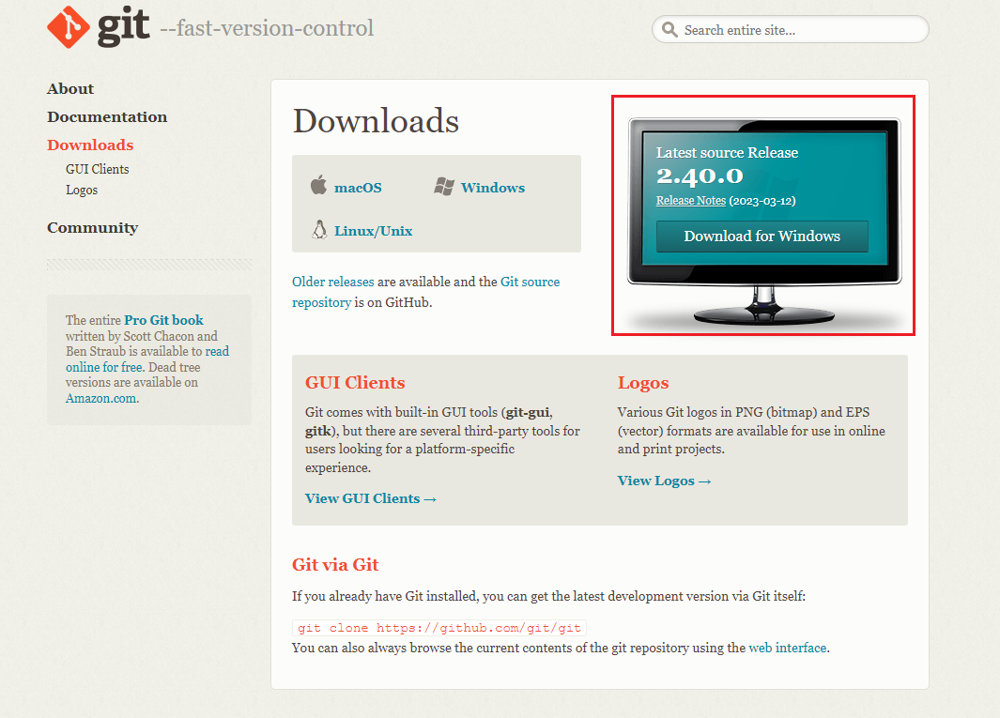
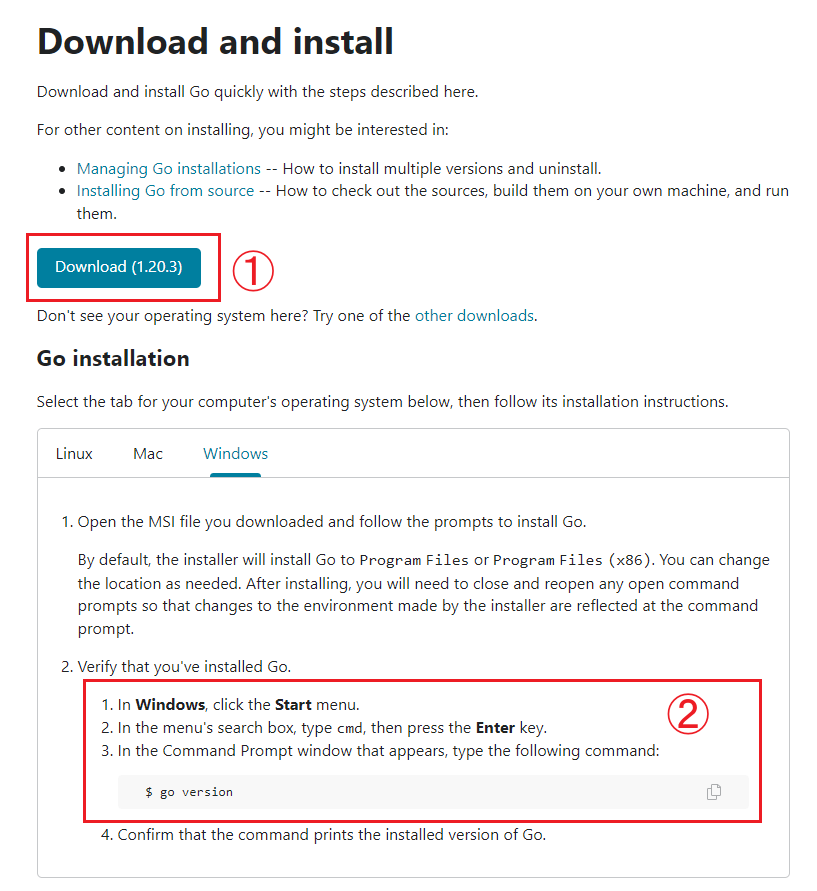
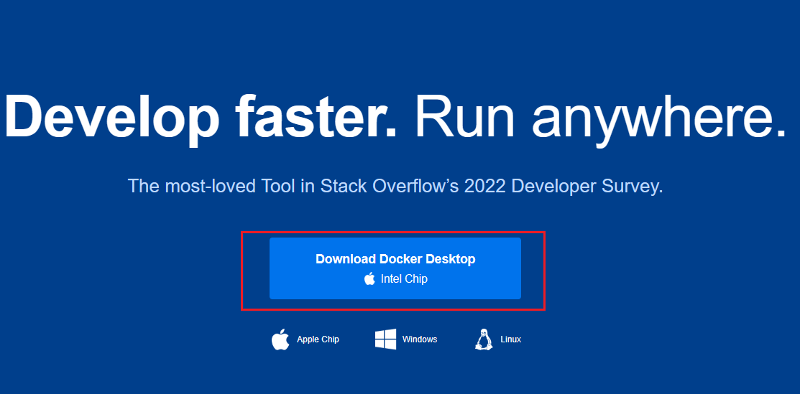

# 个人博客搭建

## 环境搭建

- 网站生成器： [Hugo](https://gohugo.io/)
- 部署：[Vercel](https://vercel.com/)

## Hugo环境搭建

- [Git](https://git-scm.com/downloads)

  

- [Go](https://go.dev/doc/install)

  

- [Docker Desktop](https://www.docker.com/)

  ```shell
  # docker命令启动hugo
  docker run --rm -it   -v $(pwd):/src   klakegg/hugo new site hugo
  ```

  

  

- [Chocolatey](https://chocolatey.org/install#individual)

  **以管理员方式打开 PowerShell**

  ```powershell
  Set-ExecutionPolicy Bypass -Scope Process -Force; [System.Net.ServicePointManager]::SecurityProtocol = [System.Net.ServicePointManager]::SecurityProtocol -bor 3072; iex ((New-Object System.Net.WebClient).DownloadString('https://community.chocolatey.org/install.ps1'))
  ```

- **Hugo**

  **以管理员方式打开terminal**

  ```bash
  choco install hugo-extended
  ```

  **安装完成后关闭terminal重新打开**

  ```sh
  hugo version
  ```

## 快速入门

使用Terminal执行以下命令创建入门网站

```sh
# 创建quickstart目录，并在该目录下生成项目结构
hugo new site quickstart
# 切换到quickstart文件夹
cd quickstart
# 用git做版本记录
git init
# 使用git克隆Ananke主题到themes文件夹
git submodule add https://github.com/theNewDynamic/gohugo-theme-ananke themes/ananke
# 给config.toml追加 "theme = 'ananke'" 
echo "theme = 'ananke'" >> config.toml
# 启动hugo
hugo server
```

### 1.添加内容

#### 添加页面

---

编辑`my-first-post.md`即可同步更新页面内容

```sh
# 添加新页面到content/posts目录下
hugo new posts/my-first-post.md
```

---

### 发布网站

```
# 将静态资源打包到public文件夹下
hugo
```


